# FinTech Product Analytics & Decision Intelligence Platform

**End-to-end analytics for a digital lender: synthetic source systems → data-quality gate → DuckDB warehouse →
50 SQL analyses → governed KPIs → A/B testing → segmentation → anomaly detection → interactive dashboard and Power BI
model → an AI analyst that cannot invent numbers.**


> **All data in this repository is synthetic.** *Vittora Credit* is a fictional Indian digital lender; customers,
> loans, campaigns and events are generated by `python/generate_data.py` (seeded, reproducible). Any resemblance to
> real companies or people is coincidental.

---

## The business problem

Vittora Credit acquires ~4,000 customers a month across 7 lending products (personal loans, salary advance, BNPL,
consumer durables, business micro-loans, a P2P marketplace and a new flexi credit line). Leadership could not answer
basic questions with confidence: *where does the funnel leak, which channels pay back, is credit quality slipping
after the festive push, did the onboarding redesign work, and can we trust the numbers?* Each team reported from
its own spreadsheet with its own definitions.

This project is the analytics platform built to answer those questions - and to keep answering them every Monday
without manual work. Full context: [business requirements](docs/business_requirements.md) · [case study](docs/case_study.md).

## Key findings (24 months, 1.25M synthetic rows, extract date 30 Jun 2026)

| # | Finding | Evidence |
|---|---|---|
| 1 | **KYC is the biggest leak**: only 59.0% of signups complete KYC; 21,205 customers are lost between KYC start and completion - more than at any other step. Web (43.9% 7-day completion) trails iOS by 17.0 pp. | `02_funnel_dropoff`, [funnel chart](docs/images/funnel.png) |
| 2 | **The onboarding redesign works**: in a 6-week A/B test (4,950 users) 7-day KYC completion rose from 58.51% to 61.78% (**+3.26 pp, 95% CI +0.54 to +5.99, p = 0.019**); approval and first-payment-default guardrails held. Shipped 2 Mar 2026. | [experiment readout](outputs/experiments/EXP-ONB-2026-01_readout.md) |
| 3 | **Cheap signups are expensive borrowers**: paid social and affiliate return **1.3x-1.4x** LTV:CAC versus **9.4x** for referral and **9.0x** for employer partnerships. | `05_customer_ltv`, [unit economics](docs/images/channel_unit_economics.png) |
| 4 | **Festive growth diluted credit quality**: first-loan FPD30 for affiliate loans rose from 1.71% to 4.49% in Oct-Nov 2025; those loans are now reaching write-off - June 2026 credit losses **+46.1% MoM**, net revenue **-17.2%** while gross revenue grew. | `07_delinquency`, [vintage curves](docs/images/vintage_curves.png) |
| 5 | **A fraud ring was visible in the data**: 8-21 Sep 2025 "Affiliate Network B" drove a 14-day signup spike (z = 6.8), approval rate fell 11.7 pp that month (KYC-mismatch and fraud rejections = 43% of rejections), and the campaign produced 4 funded customers at **₹1.39 L per funded customer**. | anomaly episodes, campaign scorecard |
| 6 | **Not every anomaly is a business problem**: the May 2025 KYC "drop" was an Android 5.2.0 tracking bug (only 52.5% of completions tracked) - backend KYC was normal. The Aug 2025 payment-failure spike (47.1% vs 8.9% expected) *was* real: a gateway outage. | [anomalies](docs/images/anomalies.png) |
| 7 | **Value is concentrated**: the top 10% of borrowers generate **59.4%** of net revenue; K-Means finds a "high-value borrower" segment that is 24.9% of borrowers but **69.2%** of net revenue, and a credit-stressed 2.0% that destroys 20.8%. Personal Loans are 53.3% of revenue; BNPL is 24% of loans but 1.3% of revenue. | `05_customer_ltv`, [segments](docs/images/segments.png), `06_revenue_analysis` |
| 8 | **Autopay is the repayment lever**: autopay borrowers repay on time more often and return for a repeat loan within 90 days 56.4% vs 46.9% of the time; the autopay-nudge test lifted take-up **+17.7 pp**. | `09_repeat_borrowing`, EXP-RPY-2025-11 |

## How it works

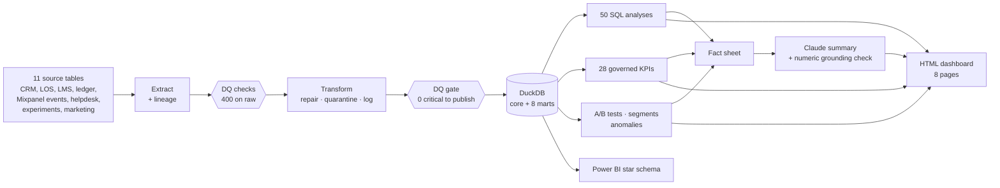

Detail: [architecture](docs/architecture.md) · [technical documentation](docs/technical_documentation.md).

## What's inside

| Capability | Where | Highlights |
|---|---|---|
| **Synthetic data** | [`python/generate_data.py`](python/generate_data.py) | 81,525 customers, 46,988 applications, 20,661 loans, 125,584 instalments, 131,285 ledger entries, 832,231 events; 11 planted business patterns and 27 planted data defects |
| **Data quality** | [`data_quality/`](data_quality) | Contracts as code (YAML), 400+ checks across schema, completeness, uniqueness, validity, timeliness, integrity, plausibility and 5 cross-table reconciliations; **DQ score 92.0 → 99.1, critical failures 22 → 0, 27/27 planted defects detected**; [HTML report](outputs/data_quality/data_quality_report.html) |
| **ETL** | [`etl/`](etl) | Lineage (md5, rows), 27 repair rules (UTC→IST timestamps, APR in basis points, x100 typos, attribution from campaign tags), quarantine with reasons, PK/FK-enforced load |
| **SQL** | [`sql/`](sql) | 8 marts + 15 analytics files / 50 queries: funnels, drop-off (GROUPING SETS), cohorts, MAU growth accounting, LTV:CAC, revenue (MoM/YoY/FYTD), point-in-time PAR30/NPA, vintage curves, repeat borrowing (LEAD), sessionisation (LAG + running SUM), RFM (NTILE), anomaly screen, reconciliation |
| **KPIs** | [`python/kpi_definitions.py`](python/kpi_definitions.py) | 28 governed KPIs with targets, deltas, z-scores and maturity-aware reporting - one definition shared by SQL, Power BI and the AI layer |
| **A/B testing** | [`python/experiment_analysis.py`](python/experiment_analysis.py) | SRM, z-test, CIs (absolute and relative), power / MDE / sample size, Bayesian P(better), non-inferiority guardrails, novelty check, Holm-corrected segments, impact sizing |
| **Segmentation** | [`python/segmentation.py`](python/segmentation.py) | 8 rule-based CRM segments with actions + K-Means on 11 behavioural/value features of 14,014 borrowers (k = 6 by silhouette under an actionability constraint; seed-stability ARI 0.999), each cluster mapped to a CRM play |
| **Anomaly detection** | [`python/anomaly_detection.py`](python/anomaly_detection.py) | Seasonality-aware robust z-scores, binomial/Poisson noise floors, episodes, driver attribution, business-calendar context |
| **Dashboard** | [`dashboard/`](dashboard) | Self-contained 8-page HTML dashboard rebuilt on every run (SVG charts, tooltips, table views, light/dark); opens offline in any browser |
| **Power BI** | [`powerbi/`](powerbi) | Star schema extract (26 tables), 79 DAX measures, Power Query loader, theme, 8-page build spec |
| **AI analyst** | [`ai_analyst/`](ai_analyst) | Claude writes the weekly summary from a numbered fact sheet; every number is machine-verified against the facts it cites; Q&A runs guarded read-only SQL. Works offline with a deterministic summariser. [Sample summary](outputs/ai/executive_summary.md) |
| **Automation** | [`pipeline.py`](pipeline.py), [workflow](.github/workflows/weekly_pipeline.yml) | 16-step orchestrator with a DQ gate, run manifests, weekly GitHub Actions schedule, Windows Task Scheduler script |
| **Tests** | [`tests/`](tests) | 78 tests: generator invariants, every DQ check, ETL rules, statistics vs textbook values, anomaly detector, grounding checker and SQL guard, contract/DDL consistency, full end-to-end pipeline |

## Dashboard

Open [`dashboard/index.html`](dashboard/index.html) in any browser (no server or installs needed). It is rebuilt
from the pipeline outputs on every run (`python pipeline.py --steps dashboard`), so every number traces back to
the SQL, KPI, experiment and DQ outputs:

| Page | Answers |
|---|---|
| Overview | Headline revenue, the grounded weekly summary, KPI tiles vs target, what needs attention, experiment decisions |
| Funnel | Stage conversion, KYC completion by platform / tier / employment / channel, channel scorecard, KYC trend around the A/B test |
| Product | MAU growth accounting, event volumes, product mix, feature adoption, approval and offer-acceptance trend |
| Cohorts | Retention heatmap, borrowers vs non-borrowers, cohort FPD30, CRM segments |
| Portfolio | PAR30/NPA trend, past-due share by product, vintage curves, early default by segment, repeat borrowing |
| Revenue | Revenue components vs write-offs, product economics, LTV:CAC, value concentration, K-Means segments |
| Experiments | Each test's stats, forest plot of primary/secondary/guardrail effects, power, novelty and segment checks |
| Data quality | DQ score raw → curated, failed checks by table, open issues, anomaly episodes, repair log, defect recall |

## Gallery

| | |
|---|---|
| 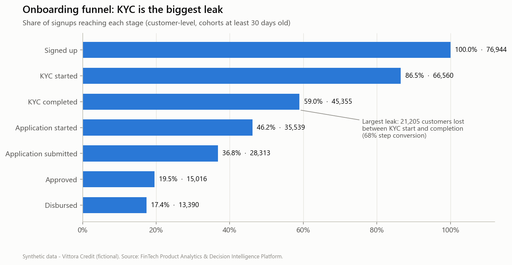 | 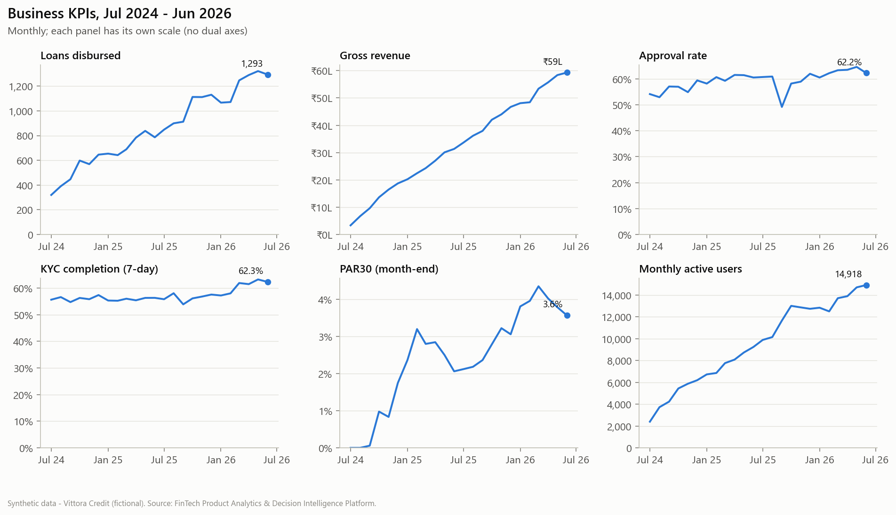 |
| 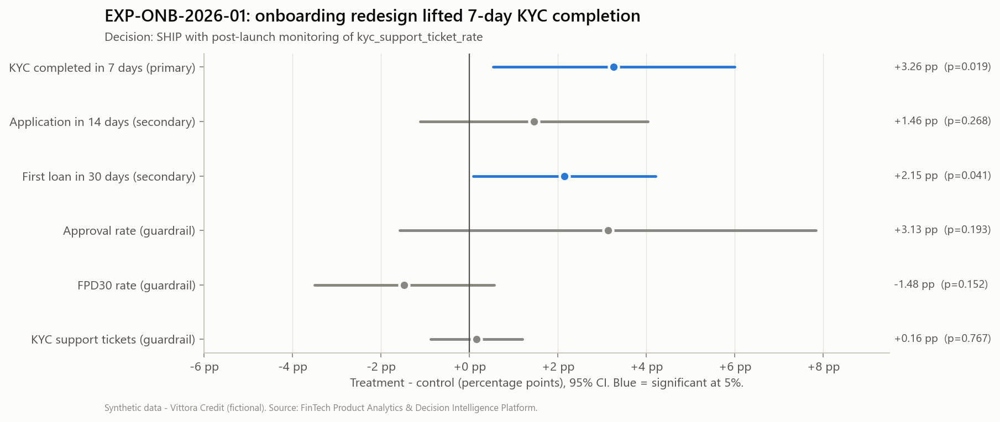 | 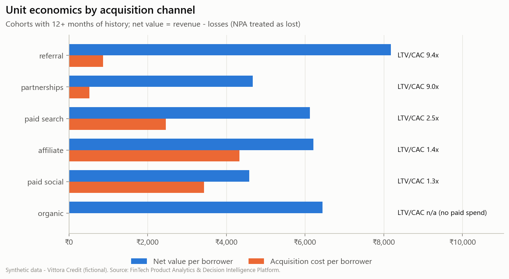 |
| 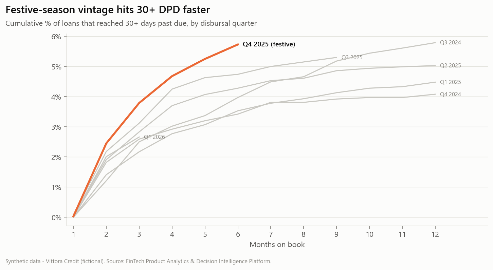 | 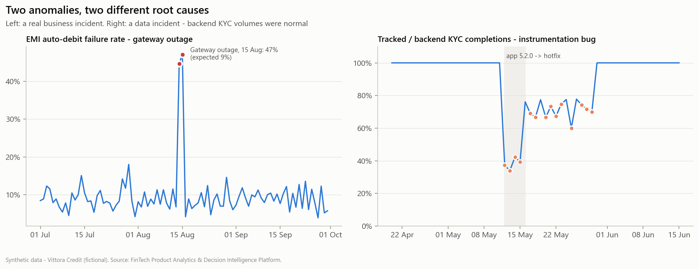 |
| 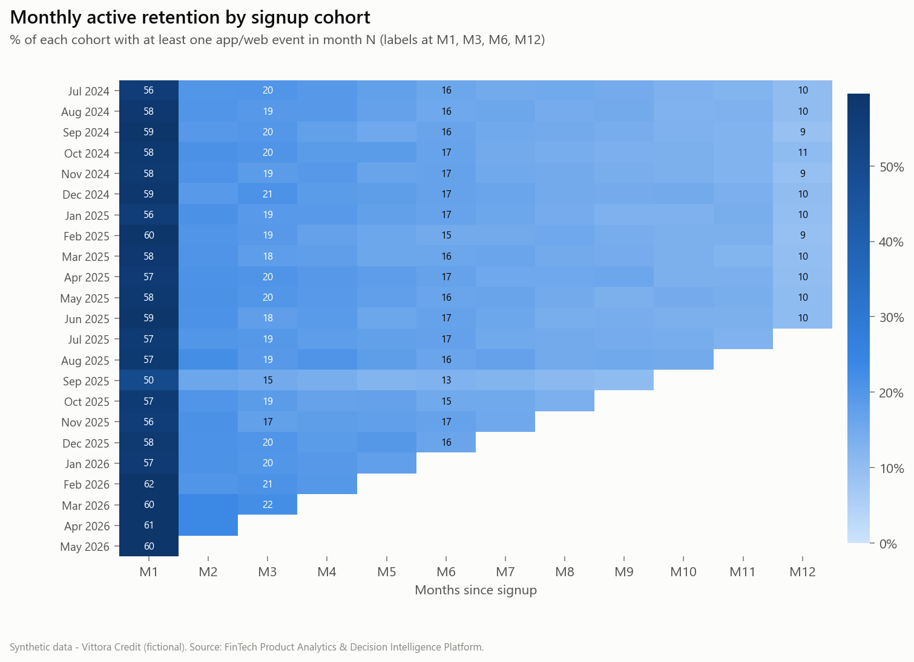 | 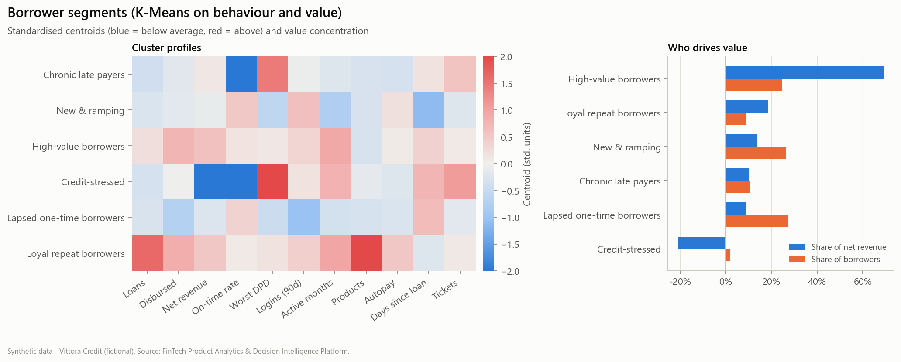 |
| 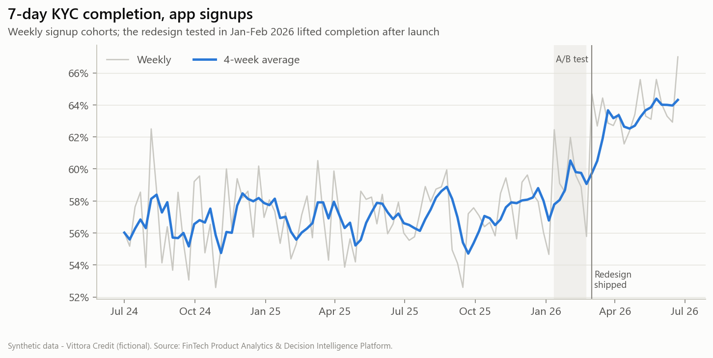 | 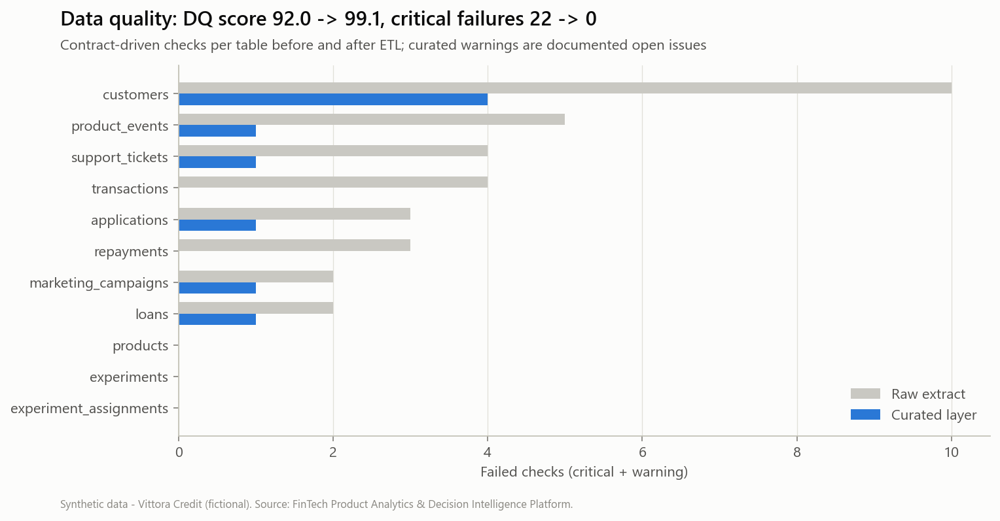 |

Power BI page screenshots: build the report from [`powerbi/dashboard_spec.md`](powerbi/dashboard_spec.md) and export
the pages to `docs/images/powerbi/` (the `.pbix` is a binary built in Power BI Desktop and is not committed).

## Quick start

```bash
git clone https://github.com/AyushyamanSingh/fintech-product-analytics-platform.git && cd fintech-product-analytics-platform
python -m venv .venv
# Windows
.venv\Scripts\pip install -r requirements.txt
.venv\Scripts\python pipeline.py --generate --offline-ai
# macOS / Linux
.venv/bin/pip install -r requirements.txt && .venv/bin/python pipeline.py --generate --offline-ai
```

About 2 minutes later: warehouse in `data/warehouse/`, results in `outputs/`, charts in `docs/images/`,
Power BI extract in `powerbi/data/`, the weekly summary in `outputs/ai/executive_summary.md` and the dashboard in
`dashboard/index.html`.

| Want to... | Run |
|---|---|
| Let Claude write the summary | set `ANTHROPIC_API_KEY` (or `ant auth login`), then `python pipeline.py` |
| Ask a question in plain English | `python -m ai_analyst.cli ask "Which channel has the best LTV to CAC?"` |
| Re-run only some steps | `python pipeline.py --steps kpis,anomalies,ai_summary` |
| Run the tests | `python -m pytest -q` |
| Rebuild the notebooks | `pip install -r requirements-notebooks.txt && python notebooks/build_notebooks.py` |

## Repository structure

```
├── pipeline.py                 # orchestrator (16 steps, DQ gate, run manifest)
├── data/                       # raw / processed / quarantine / warehouse (generated) + sample/ (committed)
├── sql/
│   ├── ddl/                    # core schema with PK/FK/CHECK, Postgres index plan
│   ├── marts/                  # 8 analytics-ready marts
│   ├── analytics/              # 15 files, 50 named queries
│   └── kpis/                   # monthly + weekly KPI SQL
├── python/                     # generator, KPIs, experiments, segmentation, anomalies, charts, exports
├── etl/                        # extract / transform / load
├── data_quality/               # contracts.yaml, checks, reconciliations, runner (gate), report
├── ai_analyst/                 # fact sheet, Claude client, grounding checker, summariser, Q&A, SQL guard
├── dashboard/                  # template.html + generated index.html (8-page interactive dashboard)
├── powerbi/                    # DAX, Power Query, theme, data model, dashboard spec
├── notebooks/                  # 5 executed notebooks (generated from build_notebooks.py)
├── tests/                      # unit + end-to-end tests
├── docs/                       # requirements, architecture, dictionary, metrics, taxonomy, case study
├── outputs/                    # latest run: SQL results, KPIs, DQ report, experiments, segments, AI summary
└── .github/workflows/          # weekly pipeline + CI
```

## Documentation

| Document | Contents |
|---|---|
| [Business requirements](docs/business_requirements.md) | Stakeholders, questions, objectives, KPI targets, scope |
| [Architecture](docs/architecture.md) | System, data model, orchestration and AI-design diagrams |
| [Technical documentation](docs/technical_documentation.md) | Generator design, DQ framework, ETL rules, SQL conventions, methods, operations, limitations |
| [Data dictionary](docs/data_dictionary.md) | Every table and column (generated from the contracts + warehouse) |
| [Metric definitions](docs/metric_definitions.md) | The 28 governed KPIs |
| [Event taxonomy](docs/event_taxonomy.md) | Mixpanel-style tracking plan and instrumentation checks |
| [Testing](docs/testing.md) | Test strategy, coverage, how to run |
| [Case study](docs/case_study.md) | The portfolio write-up: problem → approach → findings → recommendations → results |

## Limitations

Synthetic data reflects the patterns it was designed with; revenue is cash-basis without cost of funds or opex;
LTV is realised value to date; observational correlations (e.g. autopay vs repayment) are labelled as such - only the
A/B tests support causal claims. See [technical documentation §13](docs/technical_documentation.md#13-known-limitations).

---

Built by **Ayushyaman Singh** - Data Analyst (product analytics · BI) · [LinkedIn](https://linkedin.com/in/ayushyaman-singh)
