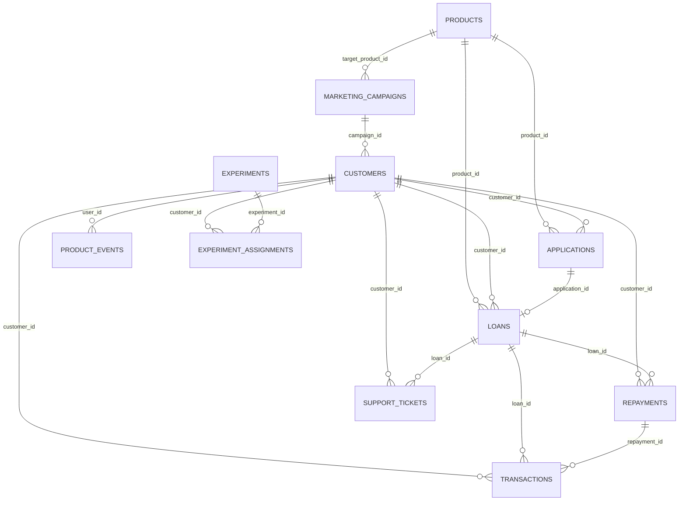
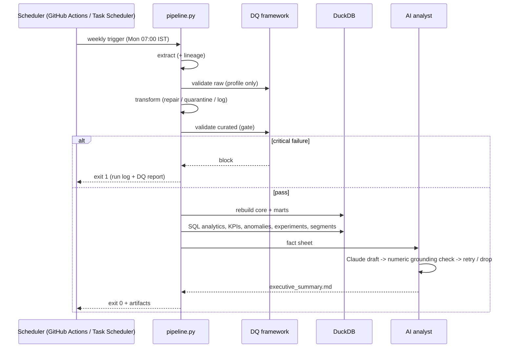
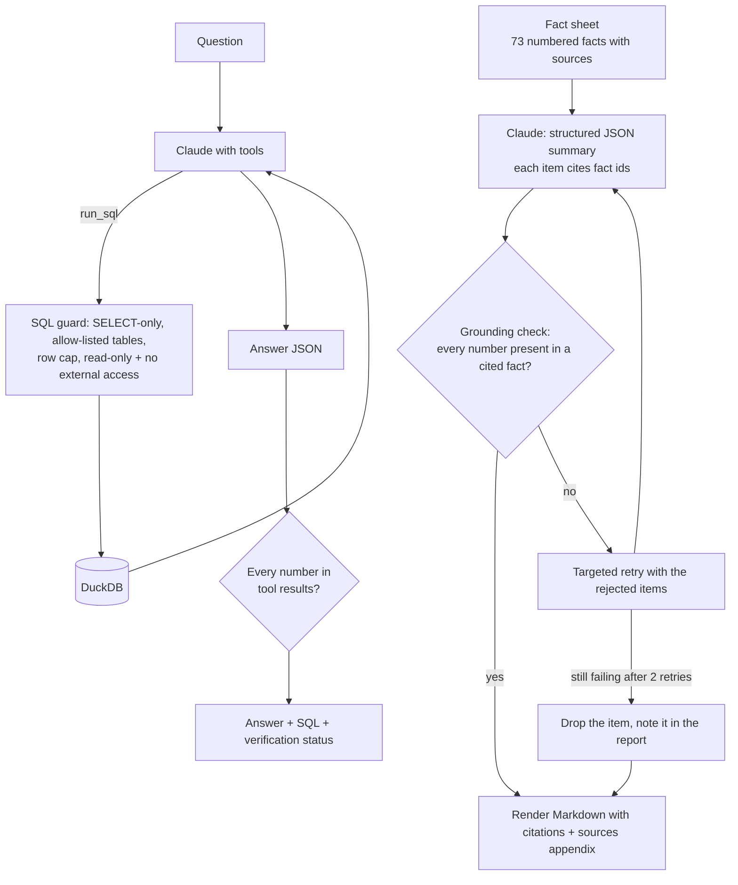

# Architecture

_Synthetic data - fictional lender Vittora Credit._

## 1. System overview

```mermaid
flowchart LR
    subgraph SRC["Source systems (simulated)"]
        CRM[CRM<br/>customers]
        LOS[Loan origination<br/>applications]
        LMS[Loan management<br/>loans, repayments]
        PAY[Payment gateway<br/>transactions]
        EVT[Mixpanel export<br/>product_events]
        HD[Helpdesk<br/>support_tickets]
        EXP[Experimentation<br/>experiments, assignments]
        MKT[Marketing<br/>campaigns]
    end
    SRC -->|CSV / CSV.gz| RAW[(data/raw)]
    RAW --> EX[Extract<br/>lineage: md5, rows]
    EX --> V1{{DQ checks<br/>raw layer}}
    V1 --> TR[Transform<br/>type, dedupe, repair,<br/>quarantine, log]
    TR --> V2{{DQ gate<br/>curated layer}}
    V2 -->|critical = 0| PQ[(data/processed<br/>Parquet)]
    V2 -.->|critical > 0| STOP[Stop + alert]
    TR --> Q[(data/quarantine)]
    PQ --> WH[(DuckDB warehouse<br/>core: PK/FK enforced)]
    WH --> MARTS[(marts: funnel, loan performance,<br/>portfolio snapshots, revenue ledger,<br/>customer 360, daily metrics)]
    MARTS --> SQL[SQL analytics<br/>50 queries]
    MARTS --> KPI[KPI layer<br/>28 governed KPIs]
    MARTS --> AN[Anomaly detection]
    MARTS --> AB[Experiment analysis]
    MARTS --> SEG[Segmentation]
    SQL & KPI & AN & AB & SEG --> FACTS[Fact sheet<br/>numbered, sourced]
    FACTS --> AI[AI analyst<br/>Claude + grounding check]
    AI --> SUM[Weekly executive summary]
    MARTS --> PBI[Power BI extract<br/>star schema CSV]
    PBI --> REPORT[8-page Power BI report]
    SQL & KPI & AB & SEG --> CHARTS[Charts / docs]
```

## 2. Layers

| Layer | Storage | Produced by | Contract |
|---|---|---|---|
| Raw | `data/raw/*.csv(.gz)` | source systems (`python/generate_data.py`) | as delivered - may contain defects |
| Curated | `data/processed/*.parquet` | `etl/transform.py` | `data_quality/contracts.yaml`, zero critical failures |
| Quarantine | `data/quarantine/*_quarantine.csv` | `etl/transform.py` | rows that cannot be repaired, with a reason |
| Core | DuckDB `core.*` | `etl/load.py` + `sql/ddl/01_core_schema.sql` | PK/FK/CHECK constraints enforced at load |
| Marts | DuckDB `marts.*` | `sql/marts/*.sql` | business definitions in one place |
| Serving | `outputs/`, `powerbi/data/`, `docs/images/` | analytics modules | consumed by people, Power BI and the AI layer |

## 3. Data model (core)

Column-level detail: [data_dictionary.md](data_dictionary.md).

## 4. Pipeline orchestration

Each run writes `outputs/run_logs/run_<id>.json` with step status, duration and row counts.

## 5. AI analyst design

Why this design: LLMs are good at selecting and phrasing, unreliable at arithmetic and prone to plausible
invented figures. Pushing every calculation into SQL/Python and making the model cite governed facts turns
"trust the model" into "verify the model" - each number in a stakeholder document is traceable to a file.

## 6. Technology choices

| Need | Choice | Why |
|---|---|---|
| Warehouse | DuckDB | Columnar, PostgreSQL-flavoured SQL, zero infrastructure, enforces PK/FK; the SQL ports to Postgres/Snowflake with minor date-function changes |
| Storage format | Parquet (ZSTD) | Typed, compressed curated layer |
| Processing | pandas / numpy | Team-standard analyst tooling |
| Statistics / ML | scipy, scikit-learn | z-tests, power, chi-square; K-Means, silhouette |
| BI | Power BI | Organisation standard for executive reporting |
| LLM | Claude (Anthropic API) | Structured outputs + tool use; deterministic fallback keeps the pipeline LLM-optional |
| Orchestration | Python CLI + GitHub Actions / Windows Task Scheduler | Simple, observable, no extra services |
