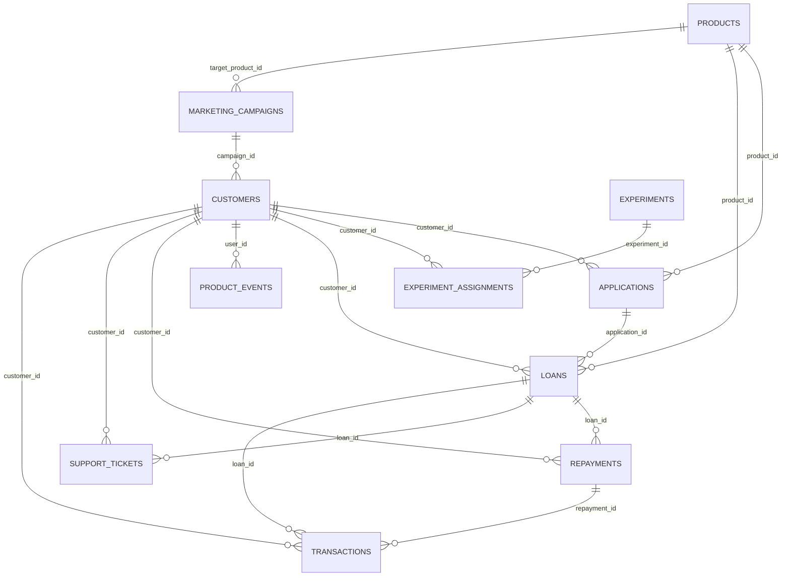

# Data Dictionary

> **All data is synthetic** (fictional lender *Vittora Credit*). Generated from `data_quality/contracts.yaml` and warehouse metadata by `python/build_data_dictionary.py` - do not edit by hand.

Contract version: `1.4.0` - extract window 2024-07-01 to 2026-06-30.

## Core layer (curated source tables)

| Table | Grain | Source system | Rows | Primary key |
|---|---|---|---:|---|
| [`core.products`](#coreproducts) | One row per product | Product config | 7 | `product_id` |
| [`core.marketing_campaigns`](#coremarketingcampaigns) | One row per campaign flight | Marketing | 122 | `campaign_id` |
| [`core.customers`](#corecustomers) | One row per customer | CRM | 81,200 | `customer_id` |
| [`core.applications`](#coreapplications) | One row per application | LOS | 46,871 | `application_id` |
| [`core.loans`](#coreloans) | One row per disbursed loan | LMS | 20,661 | `loan_id` |
| [`core.repayments`](#corerepayments) | One row per loan instalment | LMS | 125,584 | `repayment_id` |
| [`core.transactions`](#coretransactions) | One row per payment attempt / ledger entry | Payments ledger | 130,997 | `transaction_id` |
| [`core.product_events`](#coreproductevents) | One row per tracked event | Event tracking (Mixpanel export) | 828,637 | `event_id` |
| [`core.support_tickets`](#coresupporttickets) | One row per ticket | Helpdesk | 6,446 | `ticket_id` |
| [`core.experiments`](#coreexperiments) | One row per experiment | Experimentation platform | 3 | `experiment_id` |
| [`core.experiment_assignments`](#coreexperimentassignments) | One row per experiment x customer (first exposure) | Experimentation platform | 7,308 | `assignment_id` |

Relationships (enforced as foreign keys in `sql/ddl/01_core_schema.sql`):

### core.products

Lending product catalogue (7 products). Source: product configuration service.

| Column | Type | Nullable | Rules | Description |
|---|---|---|---|---|
| `product_id` | VARCHAR | no | pattern `^P\d{2}$` | Product identifier (P01-P07) |
| `product_name` | VARCHAR | no |  | Customer-facing product name |
| `product_category` | VARCHAR | no | in {personal_loan, salary_advance, bnpl, consumer_durable, business_loan, p2p_loan, credit_...} | Product family |
| `min_amount` | DECIMAL(18,2) | no | range [0, ] | Minimum sanctionable principal (INR) |
| `max_amount` | DECIMAL(18,2) | no | range [0, ] | Maximum sanctionable principal (INR) |
| `min_tenure_months` | BIGINT | no | range [1, 60] | Shortest tenure offered |
| `max_tenure_months` | BIGINT | no | range [1, 60] | Longest tenure offered |
| `base_apr_pct` | DOUBLE | no | range [0, 60] | Base annual percentage rate before risk-based pricing |
| `processing_fee_pct` | DOUBLE | no | range [0, 10] | Upfront processing fee as % of principal (deducted at disbursal) |
| `revenue_model` | VARCHAR | no | in {interest_and_fees, platform_fee} | interest_and_fees = balance-sheet lending; platform_fee = P2P (interest goes to lenders) |
| `launch_date` | DATE | no |  | Date the product went live |
| `is_secured` | BOOLEAN | no |  | Whether the product is collateralised |
| `is_active` | BOOLEAN | no |  | Currently offered to new customers |

Table rules: `min_amount <= max_amount` (critical); `min_tenure_months <= max_tenure_months` (critical).

### core.marketing_campaigns

Paid acquisition campaigns with spend and delivery metrics. Source: marketing spend sheet + ad platforms.

| Column | Type | Nullable | Rules | Description |
|---|---|---|---|---|
| `campaign_id` | VARCHAR | no | pattern `^CMP-` | Campaign identifier |
| `campaign_name` | VARCHAR | no |  | Human-readable campaign name |
| `channel` | VARCHAR | no | in {paid_search, paid_social, affiliate, referral, partnerships} | Acquisition channel |
| `objective` | VARCHAR | no | in {acquisition, referral, seasonal_acquisition} | Campaign objective |
| `target_product_id` | VARCHAR | yes | FK -> `products.product_id` | Product promoted (null = brand / multi-product) |
| `start_date` | DATE | no |  | Flight start |
| `end_date` | DATE | no |  | Flight end |
| `budget_inr` | DECIMAL(18,2) | no | range [0, ] | Approved budget (INR) |
| `spend_inr` | DECIMAL(18,2) | no | range [0, ] | Actual spend (INR) |
| `impressions` | BIGINT | no | range [0, ] | Ad impressions / referral link views |
| `clicks` | BIGINT | no | range [0, ] | Clicks / link opens |

Table rules: `start_date <= end_date`; `spend_inr <= 1.5 * budget_inr` (warning); `clicks <= impressions` (warning).

### core.customers

Customer master: acquisition, demographics, bureau data and KYC state. Source: CRM.

| Column | Type | Nullable | Rules | Description |
|---|---|---|---|---|
| `customer_id` | VARCHAR | no | pattern `^C\d{6}$` | Customer identifier |
| `signup_ts` | TIMESTAMP | no |  | Account creation timestamp (IST) |
| `acquisition_channel` | VARCHAR | no | in {organic, paid_search, paid_social, affiliate, referral, partnerships} | Last-touch acquisition channel |
| `campaign_id` | VARCHAR | yes | FK -> `marketing_campaigns.campaign_id` | Attributed campaign (null for organic) |
| `signup_platform` | VARCHAR | no | in {android, ios, web} | Platform used at signup |
| `city` | VARCHAR | no | warning-level | City of residence |
| `state` | VARCHAR | no |  | State / UT of residence |
| `city_tier` | VARCHAR | no | in {tier_1, tier_2, tier_3} | City tier (RBI-style population tiers) |
| `age` | BIGINT | no | range [18, 75]; warning-level | Age in years at signup (impossible values are nulled by ETL) |
| `employment_type` | VARCHAR | no | in {salaried, self_employed, gig_worker, student} | Self-declared employment type |
| `monthly_income` | DECIMAL(18,2) | no | range [1000, 1500000]; outlier check; warning-level | Self-declared monthly income (INR) |
| `credit_score` | BIGINT | yes | range [300, 900] | Bureau score at signup (null = new-to-credit) |
| `kyc_status` | VARCHAR | no | in {not_started, pending, verified, failed} | Current KYC state |
| `kyc_started_ts` | TIMESTAMP | yes |  | First KYC step started |
| `kyc_completed_ts` | TIMESTAMP | yes |  | KYC verified (from KYC vendor callback) |
| `kyc_method` | VARCHAR | yes | in {aadhaar_okyc, digilocker, ckyc, video_kyc} | Verification method used |
| `marketing_opt_in` | BOOLEAN | no |  | Consented to marketing communication |
| `is_ntc` | BOOLEAN | no | derived in ETL | New-to-credit flag (no bureau score in the source record) |

Table rules: `signup_ts <= kyc_started_ts`; `kyc_started_ts <= kyc_completed_ts`; when `kyc_status == 'verified'` then `kyc_completed_ts` not null (critical).

### core.applications

Loan applications from start to decision. Source: loan origination system (LOS).

| Column | Type | Nullable | Rules | Description |
|---|---|---|---|---|
| `application_id` | VARCHAR | no | pattern `^APP\d{7}$` | Application identifier |
| `customer_id` | VARCHAR | no | FK -> `customers.customer_id` | Applicant |
| `product_id` | VARCHAR | no | FK -> `products.product_id` | Product applied for |
| `started_ts` | TIMESTAMP | no |  | Application started |
| `submitted_ts` | TIMESTAMP | yes |  | Application submitted for underwriting (null = abandoned/in progress) |
| `requested_amount` | DECIMAL(18,2) | no | range [100, 1000000] | Requested principal (INR) |
| `requested_tenure_months` | BIGINT | no | range [1, 60] | Requested tenure |
| `loan_purpose` | VARCHAR | no |  | Declared purpose |
| `application_platform` | VARCHAR | no | in {android, ios, web} | Platform used to apply |
| `is_repeat_customer` | BOOLEAN | no |  | Applicant had a previously repaid loan |
| `internal_risk_score` | DOUBLE | yes | range [0, 100] | Model probability of default x100 (null if not submitted) |
| `risk_band` | VARCHAR | yes | in {A, B, C, D, E} | Risk band derived from the score (A = lowest risk) |
| `decision` | VARCHAR | yes | in {approved, rejected} | Underwriting decision |
| `decision_ts` | TIMESTAMP | yes |  | Decision timestamp |
| `rejection_reason` | VARCHAR | yes | in {thin_credit_file, low_bureau_score, insufficient_income, high_existing_obligations, ris...} | Primary rejection reason |
| `sanctioned_amount` | DECIMAL(18,2) | yes | range [0, ] | Approved principal (may be a counter-offer below the request) |
| `application_status` | VARCHAR | no | in {in_progress, abandoned, under_review, rejected, approved_pending, offer_expired, disbur...} | Lifecycle status at extract time |

Table rules: `started_ts <= submitted_ts`; `submitted_ts <= decision_ts`; when `decision.notna()` then `decision_ts` not null (warning); when `decision == 'approved'` then `sanctioned_amount` not null (critical).

### core.loans

Disbursed loans with current servicing state. Source: loan management system (LMS).

| Column | Type | Nullable | Rules | Description |
|---|---|---|---|---|
| `loan_id` | VARCHAR | no | pattern `^LN\d{7}$` | Loan identifier |
| `application_id` | VARCHAR | no | FK -> `applications.application_id`; warning-level | Originating application (lineage gaps are flagged, never dropped) |
| `customer_id` | VARCHAR | no | FK -> `customers.customer_id` | Borrower |
| `product_id` | VARCHAR | no | FK -> `products.product_id` | Product |
| `disbursed_ts` | TIMESTAMP | no |  | Disbursal timestamp |
| `principal_amount` | DECIMAL(18,2) | no | range [100, 1000000] | Sanctioned principal (INR) |
| `processing_fee` | DECIMAL(18,2) | no | range [0, ] | Upfront fee deducted at disbursal (INR) |
| `net_disbursed_amount` | DECIMAL(18,2) | no | range [0, ] | Principal minus processing fee, credited to the borrower |
| `interest_rate_apr` | DOUBLE | no | range [5, 60] | Annual interest rate (%) |
| `tenure_months` | BIGINT | no | range [1, 60] | Number of monthly instalments |
| `emi_amount` | DECIMAL(18,2) | no | range [0, ] | Equated monthly instalment (INR) |
| `risk_band` | VARCHAR | no | in {A, B, C, D, E} | Risk band at origination |
| `autopay_enabled` | BOOLEAN | no |  | NACH / UPI-Autopay mandate registered |
| `loan_sequence_number` | BIGINT | no | range [1, ] | 1 = first loan for the customer |
| `is_repeat_loan` | BOOLEAN | no |  | loan_sequence_number > 1 |
| `maturity_date` | DATE | no |  | Scheduled final instalment date |
| `loan_status` | VARCHAR | no | in {active, delinquent, npa, written_off, closed} | Servicing state at extract (NPA = 90+ DPD, written off = 180+ DPD) |
| `current_dpd` | BIGINT | no | range [0, ] | Days past due at extract |
| `max_dpd` | BIGINT | no | range [0, ] | Worst days past due ever observed |
| `outstanding_principal` | DECIMAL(18,2) | no | range [0, ] | Principal outstanding at extract |
| `closed_date` | DATE | yes |  | Closure date (repaid or foreclosed) |
| `closure_type` | VARCHAR | yes | in {repaid, foreclosure} | How the loan closed |

Table rules: `abs(net_disbursed_amount - (principal_amount - processing_fee)) < 1` (critical); `current_dpd <= max_dpd` (critical); `outstanding_principal <= principal_amount + 1` (critical).

### core.repayments

Instalment schedule and payment outcome. Source: LMS repayment schedule.

| Column | Type | Nullable | Rules | Description |
|---|---|---|---|---|
| `repayment_id` | VARCHAR | no | pattern `^RP\d{8}$` | Instalment identifier |
| `loan_id` | VARCHAR | no | FK -> `loans.loan_id` | Loan |
| `customer_id` | VARCHAR | no | FK -> `customers.customer_id` | Borrower |
| `installment_number` | BIGINT | no | range [1, 60] | 1..tenure |
| `due_date` | DATE | no |  | Instalment due date |
| `principal_due` | DECIMAL(18,2) | no | range [0, ] | Principal component of the EMI |
| `interest_due` | DECIMAL(18,2) | no | range [0, ] | Interest component of the EMI |
| `total_due` | DECIMAL(18,2) | no | range [0, ] | Total instalment amount |
| `amount_paid` | DECIMAL(18,2) | no | range [0, ]; outlier check | Amount received against the instalment |
| `principal_paid` | DECIMAL(18,2) | no | range [0, ] | Principal portion received |
| `interest_paid` | DECIMAL(18,2) | no | range [0, ] | Interest portion received (interest is allocated first) |
| `paid_date` | DATE | yes |  | Date the payment was received |
| `payment_status` | VARCHAR | no | in {scheduled, paid_on_time, paid_late, partially_paid, overdue} | Outcome at extract |
| `days_past_due` | BIGINT | no | range [0, ] | Days late at payment, or days overdue at extract if unpaid |
| `late_fee` | DECIMAL(18,2) | no | range [0, ] | Late fee charged and collected |

Table rules: `amount_paid <= total_due * 1.01` (critical); `abs(total_due - principal_due - interest_due) < 0.05` (critical).

### core.transactions

Money-movement ledger (disbursals, EMIs, fees, failed debits). Source: payment gateway webhooks.

| Column | Type | Nullable | Rules | Description |
|---|---|---|---|---|
| `transaction_id` | VARCHAR | no | pattern `^TX\d{9}$` | Ledger entry identifier |
| `customer_id` | VARCHAR | no | FK -> `customers.customer_id` | Customer |
| `loan_id` | VARCHAR | yes | FK -> `loans.loan_id` | Loan the entry belongs to |
| `repayment_id` | VARCHAR | yes | FK -> `repayments.repayment_id` | Instalment paid (EMI and late-fee entries) |
| `txn_ts` | TIMESTAMP | no |  | Ledger timestamp |
| `txn_type` | VARCHAR | no | in {disbursement, processing_fee, emi_payment, late_fee, foreclosure_payment, foreclosure_fee} | Entry type |
| `amount` | DECIMAL(18,2) | no | range [0, ]; outlier check | Amount (INR, always positive; direction implied by type) |
| `payment_method` | VARCHAR | no | in {imps_bank_transfer, deducted_at_source, nach_autodebit, upi_autopay, upi, netbanking, d...} | Rail used |
| `txn_status` | VARCHAR | no | in {success, failed} | Gateway outcome |
| `failure_reason` | VARCHAR | yes | in {insufficient_funds, mandate_inactive, gateway_timeout, upi_txn_declined, bank_server_down} | Gateway failure code |

Table rules: when `txn_status == 'failed'` then `failure_reason` not null (warning).

### core.product_events

Mixpanel-style product analytics event stream. Source: client SDK + server-side tracking.

| Column | Type | Nullable | Rules | Description |
|---|---|---|---|---|
| `event_id` | VARCHAR | no |  | Event insert id (dedup key) |
| `user_id` | VARCHAR | no | FK -> `customers.customer_id` | distinct_id mapped to customer_id |
| `event_name` | VARCHAR | no | in {signup, login, kyc_started, kyc_completed, loan_application_started, loan_application_s...} | Event name (see docs/event_taxonomy.md) |
| `event_ts` | TIMESTAMP | no |  | Event time (IST) |
| `session_id` | VARCHAR | yes |  | Client session (null for server-side events) |
| `platform` | VARCHAR | no | in {android, ios, web, server} | Emitting platform |
| `app_version` | VARCHAR | yes |  | App build for mobile events |
| `properties` | VARCHAR | no |  | Event properties as JSON |
| `prop_product_id` | VARCHAR | yes | derived in ETL | Flattened property: product_id |
| `prop_amount` | DOUBLE | yes | derived in ETL | Flattened property: amount |
| `prop_variant` | VARCHAR | yes | derived in ETL | Flattened property: experiment variant |
| `prop_reason` | VARCHAR | yes | derived in ETL | Flattened property: rejection reason |
| `prop_category` | VARCHAR | yes | derived in ETL | Flattened property: support category |
| `prop_method` | VARCHAR | yes | derived in ETL | Flattened property: payment / login method |
| `prop_on_time` | BOOLEAN | yes | derived in ETL | Flattened property: payment on time |

### core.support_tickets

Customer-support tickets. Source: helpdesk export.

| Column | Type | Nullable | Rules | Description |
|---|---|---|---|---|
| `ticket_id` | VARCHAR | no | pattern `^TK\d{6}$` | Ticket identifier |
| `customer_id` | VARCHAR | no | FK -> `customers.customer_id` | Customer |
| `loan_id` | VARCHAR | yes | FK -> `loans.loan_id` | Related loan, if any |
| `created_ts` | TIMESTAMP | no |  | Ticket created |
| `channel` | VARCHAR | no | in {in_app_chat, email, phone, whatsapp} | Contact channel |
| `category` | VARCHAR | no | in {kyc_issue, application_status, disbursement_delay, payment_failure, collections, forecl...} | Ticket category |
| `priority` | VARCHAR | no | in {low, medium, high} | Priority |
| `first_response_minutes` | DOUBLE | no | range [0, ]; outlier check | Minutes to first agent response |
| `resolved_ts` | TIMESTAMP | yes |  | Resolution timestamp (null = open) |
| `ticket_status` | VARCHAR | no | in {open, resolved, escalated_resolved} | Status at extract |
| `csat_score` | DOUBLE | yes | range [1, 5] | Post-resolution CSAT (1-5) |

Table rules: `created_ts <= resolved_ts`.

### core.experiments

Experiment registry (pre-registered design). Source: experimentation platform.

| Column | Type | Nullable | Rules | Description |
|---|---|---|---|---|
| `experiment_id` | VARCHAR | no | pattern `^EXP-` | Experiment identifier |
| `experiment_name` | VARCHAR | no |  | Name |
| `feature_area` | VARCHAR | no |  | Product area |
| `hypothesis` | VARCHAR | no |  | Pre-registered hypothesis |
| `unit` | VARCHAR | no | in {customer} | Randomisation unit |
| `allocation_pct` | BIGINT | no | range [1, 99] | % of eligible traffic in treatment |
| `start_date` | DATE | no |  | Start |
| `end_date` | DATE | no |  | End |
| `primary_metric` | VARCHAR | no |  | Decision metric |
| `secondary_metrics` | VARCHAR | yes |  | Comma-separated secondary metrics |
| `guardrail_metrics` | VARCHAR | yes |  | Comma-separated guardrails |
| `status` | VARCHAR | no |  | Lifecycle status |
| `owner_team` | VARCHAR | no |  | Owning team |

Table rules: `start_date <= end_date`.

### core.experiment_assignments

Randomised exposure log. Source: experimentation platform.

| Column | Type | Nullable | Rules | Description |
|---|---|---|---|---|
| `assignment_id` | VARCHAR | no | pattern `^AS\d{7}$` | Assignment identifier |
| `experiment_id` | VARCHAR | no | FK -> `experiments.experiment_id` | Experiment |
| `customer_id` | VARCHAR | no | FK -> `customers.customer_id` | Randomised customer |
| `variant` | VARCHAR | no | in {control, treatment} | Assigned arm |
| `assigned_ts` | TIMESTAMP | no |  | First exposure |
| `platform` | VARCHAR | no | in {android, ios, web} | Platform at exposure |

## Marts layer (analytics-ready)

Built by `sql/marts/*.sql` on every pipeline run.

### marts.customer_360

One row per customer combining profile, lending, repayment, engagement, support and acquisition cost.

Rows: 81,200

| Column | Type |
|---|---|
| `customer_id` | VARCHAR |
| `signup_ts` | TIMESTAMP |
| `cohort_month` | DATE |
| `acquisition_channel` | VARCHAR |
| `campaign_id` | VARCHAR |
| `signup_platform` | VARCHAR |
| `city_tier` | VARCHAR |
| `state` | VARCHAR |
| `employment_type` | VARCHAR |
| `age` | BIGINT |
| `age_band` | VARCHAR |
| `monthly_income` | DECIMAL(18,2) |
| `credit_score` | BIGINT |
| `is_ntc` | BOOLEAN |
| `kyc_status` | VARCHAR |
| `onb_variant` | VARCHAR |
| `income_band` | VARCHAR |
| `n_loans` | BIGINT |
| `n_repeat_loans` | HUGEINT |
| `n_products` | BIGINT |
| `total_disbursed` | DECIMAL(38,2) |
| `avg_ticket` | DOUBLE |
| `first_loan_ts` | TIMESTAMP |
| `last_loan_ts` | TIMESTAMP |
| `total_revenue` | DECIMAL(38,2) |
| `credit_loss` | DECIMAL(38,2) |
| `net_revenue` | DECIMAL(38,2) |
| `acquisition_cost` | DOUBLE |
| `installments_due` | HUGEINT |
| `on_time_rate` | DOUBLE |
| `max_dpd_ever` | BIGINT |
| `current_dpd` | BIGINT |
| `outstanding_principal` | DECIMAL(38,2) |
| `has_open_loan` | BOOLEAN |
| `has_written_off_loan` | BOOLEAN |
| `autopay_ever` | BOOLEAN |
| `client_events_90d` | HUGEINT |
| `logins_90d` | HUGEINT |
| `active_months` | BIGINT |
| `last_active_ts` | TIMESTAMP |
| `used_credit_score` | BOOLEAN |
| `used_emi_calculator` | BOOLEAN |
| `referrals_shared` | HUGEINT |
| `support_tickets` | BIGINT |
| `avg_csat` | DOUBLE |
| `collections_tickets` | HUGEINT |
| `tenure_days` | BIGINT |
| `days_since_last_active` | BIGINT |
| `days_since_last_loan` | BIGINT |
| `lifecycle_stage` | VARCHAR |

### marts.dim_date

Calendar dimension with ISO week, month, quarter and Indian fiscal year (Apr-Mar).

Rows: 730

| Column | Type |
|---|---|
| `date_day` | DATE |
| `week_start` | DATE |
| `month_start` | DATE |
| `quarter_start` | DATE |
| `calendar_year` | INTEGER |
| `month_num` | INTEGER |
| `month_label` | VARCHAR |
| `iso_dow` | INTEGER |
| `day_name` | VARCHAR |
| `is_weekend` | BOOLEAN |
| `fiscal_year` | VARCHAR |

### marts.fct_customer_funnel

One row per customer with every onboarding/lending milestone, time-bounded conversion flags and maturity flags.

Rows: 81,200

| Column | Type |
|---|---|
| `customer_id` | VARCHAR |
| `signup_ts` | TIMESTAMP |
| `signup_date` | DATE |
| `signup_week` | DATE |
| `cohort_month` | DATE |
| `acquisition_channel` | VARCHAR |
| `campaign_id` | VARCHAR |
| `signup_platform` | VARCHAR |
| `city_tier` | VARCHAR |
| `state` | VARCHAR |
| `employment_type` | VARCHAR |
| `is_ntc` | BOOLEAN |
| `credit_score` | BIGINT |
| `age` | BIGINT |
| `age_band` | VARCHAR |
| `monthly_income` | DECIMAL(18,2) |
| `kyc_status` | VARCHAR |
| `kyc_started_ts` | TIMESTAMP |
| `kyc_completed_ts` | TIMESTAMP |
| `first_app_started_ts` | TIMESTAMP |
| `first_app_submitted_ts` | TIMESTAMP |
| `first_approved_ts` | TIMESTAMP |
| `first_disbursed_ts` | TIMESTAMP |
| `n_applications` | BIGINT |
| `n_loans` | BIGINT |
| `total_disbursed` | DECIMAL(38,2) |
| `onb_variant` | VARCHAR |
| `kyc_completed_7d` | BOOLEAN |
| `app_submitted_14d` | BOOLEAN |
| `disbursed_30d` | BOOLEAN |
| `is_mature_7d` | BOOLEAN |
| `is_mature_14d` | BOOLEAN |
| `is_mature_30d` | BOOLEAN |
| `minutes_signup_to_kyc` | BIGINT |
| `hours_kyc_to_application` | DOUBLE |
| `days_signup_to_disbursal` | DOUBLE |

### marts.fct_daily_metrics

Daily operating metrics used for trends, weekly KPIs and anomaly detection.

Rows: 730

| Column | Type |
|---|---|
| `date_day` | DATE |
| `week_start` | DATE |
| `month_start` | DATE |
| `iso_dow` | INTEGER |
| `signups` | BIGINT |
| `paid_signups` | HUGEINT |
| `kyc_completions_backend` | BIGINT |
| `kyc_completions_tracked` | BIGINT |
| `applications_started` | BIGINT |
| `applications_submitted` | BIGINT |
| `approvals` | HUGEINT |
| `rejections` | HUGEINT |
| `approval_rate` | DOUBLE |
| `loans_disbursed` | BIGINT |
| `disbursed_amount` | DECIMAL(38,2) |
| `repeat_loans` | HUGEINT |
| `payments_success` | HUGEINT |
| `payments_failed` | HUGEINT |
| `payment_failure_rate` | DOUBLE |
| `collections_amount` | DECIMAL(38,2) |
| `support_tickets` | BIGINT |
| `payment_failure_tickets` | HUGEINT |
| `kyc_tickets` | HUGEINT |
| `dau` | BIGINT |

### marts.fct_loan_performance

One row per loan: economics (interest, fees, credit loss), repayment behaviour, DPD bucket, FPD30, vintage fields.

Rows: 20,661

| Column | Type |
|---|---|
| `loan_id` | VARCHAR |
| `application_id` | VARCHAR |
| `customer_id` | VARCHAR |
| `product_id` | VARCHAR |
| `product_name` | VARCHAR |
| `product_category` | VARCHAR |
| `revenue_model` | VARCHAR |
| `disbursed_ts` | TIMESTAMP |
| `disbursal_date` | DATE |
| `disbursal_month` | DATE |
| `vintage_quarter` | DATE |
| `principal_amount` | DECIMAL(18,2) |
| `processing_fee` | DECIMAL(18,2) |
| `net_disbursed_amount` | DECIMAL(18,2) |
| `interest_rate_apr` | DOUBLE |
| `tenure_months` | BIGINT |
| `emi_amount` | DECIMAL(18,2) |
| `risk_band` | VARCHAR |
| `autopay_enabled` | BOOLEAN |
| `loan_sequence_number` | BIGINT |
| `is_repeat_loan` | BOOLEAN |
| `loan_status` | VARCHAR |
| `current_dpd` | BIGINT |
| `max_dpd` | BIGINT |
| `outstanding_principal` | DECIMAL(18,2) |
| `closed_date` | DATE |
| `closure_type` | VARCHAR |
| `acquisition_channel` | VARCHAR |
| `signup_platform` | VARCHAR |
| `city_tier` | VARCHAR |
| `employment_type` | VARCHAR |
| `is_ntc` | BOOLEAN |
| `interest_collected` | DECIMAL(38,2) |
| `principal_collected` | DECIMAL(38,2) |
| `late_fees` | DECIMAL(38,2) |
| `foreclosure_fees` | DECIMAL(38,2) |
| `emi_collected` | DECIMAL(38,2) |
| `installments_due` | HUGEINT |
| `installments_on_time` | HUGEINT |
| `installments_late` | HUGEINT |
| `installments_unpaid` | HUGEINT |
| `on_time_rate` | DOUBLE |
| `interest_income` | DECIMAL(38,2) |
| `fee_income` | DECIMAL(38,2) |
| `total_revenue` | DECIMAL(38,2) |
| `credit_loss` | DECIMAL(18,2) |
| `write_off_date` | DATE |
| `dpd_bucket` | VARCHAR |
| `first_due_date` | DATE |
| `first_installment_dpd` | BIGINT |
| `fpd30_mature` | BOOLEAN |
| `is_fpd30` | BOOLEAN |
| `ever_30dpd` | BOOLEAN |
| `ever_90dpd` | BOOLEAN |
| `first_30dpd_date` | DATE |
| `mob_at_first_30dpd` | BIGINT |
| `months_on_book` | BIGINT |

### marts.fct_portfolio_monthly

Point-in-time month-end portfolio snapshot by product (outstanding, PAR30, NPA, write-offs).

Rows: 159

| Column | Type |
|---|---|
| `month_start` | DATE |
| `month_end` | DATE |
| `product_id` | VARCHAR |
| `loans_on_book` | HUGEINT |
| `outstanding_principal` | DECIMAL(38,2) |
| `dpd_1_29_outstanding` | DECIMAL(38,2) |
| `par30_outstanding` | DECIMAL(38,2) |
| `npa_outstanding` | DECIMAL(38,2) |
| `par30_loans` | HUGEINT |
| `npa_loans` | HUGEINT |
| `loans_written_off` | BIGINT |
| `written_off_principal` | DECIMAL(38,2) |

### marts.fct_revenue_events

Revenue ledger at recognition date (interest, fees, credit losses) - the single source for revenue metrics.

Rows: 96,622

| Column | Type |
|---|---|
| `revenue_date` | DATE |
| `customer_id` | VARCHAR |
| `loan_id` | VARCHAR |
| `product_id` | VARCHAR |
| `component` | VARCHAR |
| `amount` | DECIMAL(18,2) |

### marts.fct_user_activity_monthly

Customer x month activity counts (client events, logins, sessions, payments, feature events).

Rows: 241,633

| Column | Type |
|---|---|
| `customer_id` | VARCHAR |
| `activity_month` | DATE |
| `client_events` | HUGEINT |
| `logins` | HUGEINT |
| `sessions` | BIGINT |
| `active_days` | BIGINT |
| `payments` | HUGEINT |
| `feature_events` | HUGEINT |
| `total_events` | BIGINT |

### marts.run_params

Single-row table holding the extract (as-of) date and window start used by every query.

Rows: 1

| Column | Type |
|---|---|
| `as_of_date` | DATE |
| `start_date` | DATE |

## Governed KPIs

Full definitions: [metric_definitions.md](metric_definitions.md).

| KPI | Category | Unit | Definition |
|---|---|---|---|
| New customers | Acquisition | count | Customers who created an account in the month. |
| KYC completion (7-day) | Onboarding | pct | Share of the month's signups that completed KYC within 7 days of signup. |
| Activation rate (first loan in 30 days) | Onboarding | pct | Activation: share of the month's signups that received a first loan within 30 days of signup. |
| Applications submitted | Lending | count | Loan applications submitted for underwriting in the month. |
| Approval rate | Lending | pct | Approved decisions / all decisions made in the month. |
| Offer acceptance (disbursal rate) | Lending | pct | Share of approvals in the month that were disbursed. |
| Loans disbursed | Lending | count | Loans disbursed in the month. |
| Disbursed amount | Lending | inr | Principal disbursed in the month (gross of processing fees). |
| Average ticket size | Lending | inr | Average principal per disbursed loan. |
| New borrowers | Lending | count | Customers whose first-ever loan was disbursed in the month. |
| Repeat-loan share | Retention | pct | Share of the month's disbursals that went to returning borrowers. |
| Autopay adoption | Repayments | pct | Share of the month's new loans with an active NACH/UPI-Autopay mandate. |
| Gross revenue | Revenue | inr | Interest collected (balance-sheet products) + processing, late and foreclosure fees recognised in the month. |
| Credit losses (write-offs) | Revenue | inr | Principal written off in the month (180+ DPD, company-funded products). |
| Net revenue | Revenue | inr | Gross revenue minus credit losses. |
| Outstanding principal (AUM) | Portfolio | inr | Principal outstanding on loans on book at month end (excl. written off). |
| PAR30 | Risk | pct | Outstanding principal on loans 30-179 DPD / total outstanding at month end. |
| NPA (90+ DPD) | Risk | pct | Outstanding principal on loans 90-179 DPD / total outstanding at month end (RBI NPA definition). |
| First-payment default (FPD30) | Risk | pct | Share of loans disbursed in the month whose first EMI went 30+ days past due. |
| Collection efficiency | Repayments | pct | Amount collected by month end against instalments falling due in the month. |
| Payment failure rate | Repayments | pct | Failed EMI debit attempts / all EMI debit attempts. |
| Monthly active users | Engagement | count | Distinct customers with at least one client-side (app/web) event in the month. |
| Support tickets | Support | count | Tickets created in the month. |
| Tickets per 1k MAU | Support | ratio | Support tickets per thousand monthly active users. |
| CSAT | Support | score | Average post-resolution satisfaction score (1-5). |
| Marketing spend | Marketing | inr | Paid acquisition spend, pro-rated by day across campaign flights. |
| Blended CAC | Marketing | inr | Marketing spend / all new customers (incl. organic). |
| Cost per new borrower | Marketing | inr | Marketing spend / customers taking their first loan in the month. |
