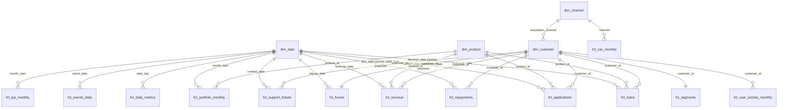

# Power BI data model

_Synthetic data - fictional lender Vittora Credit._ Tables are the CSVs written to `powerbi/data/` by
`python -m python.powerbi_export` (also run by `pipeline.py`). Load them with `powerbi/power_query/load_tables.pq`.

## Star schema

## Tables

| Table | Grain | Role | Key columns |
|---|---|---|---|
| `dim_date` | day | Date table (mark as date table on `date_day`) | `date_day`, `month_start`, `week_start`, `fiscal_year` |
| `dim_product` | product | Dimension | `product_id` |
| `dim_channel` | acquisition channel | Dimension | `channel`, `is_paid` |
| `dim_campaign` | campaign flight | Dimension (scorecard page) | `campaign_id` |
| `dim_customer` | customer | Dimension (+ value attributes) | `customer_id`, `acquisition_channel`, `lifecycle_stage` |
| `fct_funnel` | customer | Onboarding funnel flags | `customer_id`, `signup_date` |
| `fct_applications` | application | Underwriting | `application_id`, dates, `decision`, `risk_band` |
| `fct_loans` | loan | Portfolio + economics | `loan_id`, `disbursal_date`, revenue, DPD fields |
| `fct_repayments` | instalment | Collections | `repayment_id`, `due_date`, `paid_date` |
| `fct_revenue` | loan x component x day | Revenue ledger | `revenue_date`, `component`, `amount` |
| `fct_portfolio_monthly` | month x product | Month-end snapshot (semi-additive) | `month_start`, `product_id` |
| `fct_daily_metrics` | day | Operations, anomaly context | `date_day` |
| `fct_events_daily` | day x event x platform x version | Product analytics (pre-aggregated) | `event_date`, `event_name` |
| `fct_user_activity_monthly` | customer x month | MAU / retention | `customer_id`, `activity_month` |
| `fct_support_tickets` | ticket | Support | `created_date`, `category` |
| `fct_kpi_monthly` | month x KPI | Governed KPI history (long) | `month_start`, `kpi_id` |
| `fct_cohort_retention` | cohort x month number | Pre-computed matrix | `cohort_month`, `month_number` |
| `fct_vintage_curves` | vintage x MOB | Pre-computed | `vintage_quarter`, `mob` |
| `fct_channel_economics`, `fct_cac_monthly` | channel (x month) | Marketing | `acquisition_channel` / `channel` |
| `fct_experiment_results` | experiment x metric | Readouts | `experiment_id`, `metric_role` |
| `fct_experiment_weekly_effect` | week | Novelty check | `assignment_week` |
| `fct_anomaly_episodes` | episode | Monitoring | `metric`, `start`, `end` |
| `fct_dq_results_raw`, `fct_dq_results_clean`, `fct_cleaning_log` | check / rule | Data quality page | `table`, `check`, `status` |
| `fct_segments`, `dim_business_segment`, `dim_cluster` | customer / segment | Segmentation | `customer_id`, `business_segment`, `cluster` |

## Modelling decisions

* **Single-direction 1:* relationships** from dimensions to facts; no bi-directional filters (predictable
  totals, faster queries). `dim_customer` -> `fct_funnel` / `fct_segments` are 1:1.
* **Role-playing dates** use one `dim_date` with inactive relationships, activated in DAX with
  `USERELATIONSHIP` (applications: started / submitted / decision; repayments: due / paid).
* **Semi-additive stocks** (outstanding principal, PAR30, NPA) are only summed within the latest month in
  context - see `Outstanding Principal` in `dax/measures.dax`.
* **Pre-aggregation**: events arrive daily-aggregated (831k raw events -> ~20k rows); cohort and vintage
  matrices are pre-computed in SQL so the report never scans instalment history for them.
* **No calculated columns on facts**: everything derivable lives in the SQL marts (single source of truth
  shared with Python and the AI analyst).

## Row-level security (for a real deployment)

| Role | Filter | Purpose |
|---|---|---|
| `ProductManager_<P0x>` | `dim_product[product_id] = "P0x"` | PMs see their product's lending and revenue pages |
| `Marketing` | none on facts; hide `fct_repayments` | Acquisition pages only |
| `Executive` | none | Full report |

## Refresh

`pipeline.py` regenerates `powerbi/data/*.csv`; in the Power BI Service schedule a refresh after the weekly
pipeline run (Monday 07:00 IST, see `.github/workflows/weekly_pipeline.yml`) through an on-premises data
gateway pointed at the `powerbi/data` folder (or switch the source to the DuckDB/Postgres warehouse).
